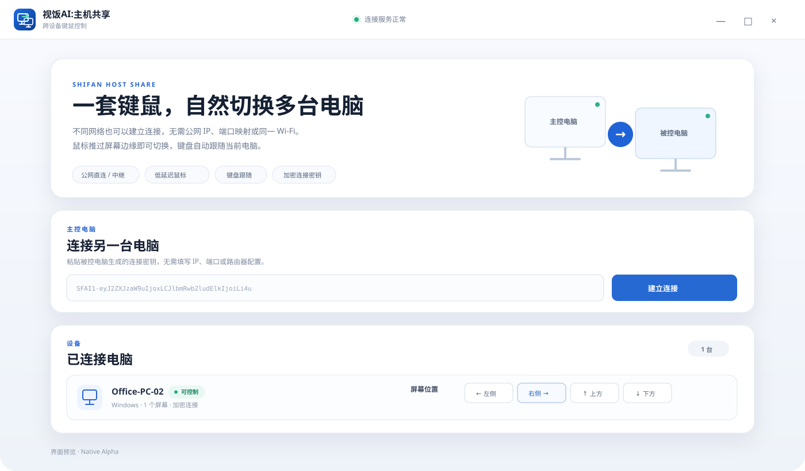

# 视饭AI:主机共享

<p align="center">
  <strong>一套键盘鼠标，跨网络控制多台 Windows / macOS 电脑</strong>
</p>

<p align="center">
  Rust · Tauri · Iroh/QUIC · Windows Native Input · macOS CoreGraphics
</p>



## 产品简介

**视饭AI:主机共享** 是一款跨设备键鼠共享工具。键盘和鼠标只需要连接在主控电脑上，鼠标推过屏幕边缘后即可进入另一台电脑，键盘随当前屏幕自动切换。

当前 Native 版本不要求两台电脑处于同一局域网，也不需要填写公网 IP、端口或配置路由器端口映射。被控电脑在公网连接路径真正就绪后生成一段 `SFAI1-` 连接密钥，主控电脑粘贴后即可建立加密连接。

当前版本：**v1.0.0-alpha.5**。

> 当前版本处于 Native Alpha 阶段。代码、Windows/macOS 原生编译和安装包流水线已经通过；不同运营商、NAT、防火墙和系统权限环境仍需持续进行实体设备验收。

## alpha.5 公网连接修复

alpha.5 针对 `No addressing information available` 做了连接层修复。旧版本的连接密钥主要依赖 EndpointId，在公网地址尚未发布或查询暂不可用时可能没有实际拨号路径。新版本改为：

- 被控电脑只有在 Iroh 公网中继地址真正可用后才显示连接密钥；
- `SFAI1-` v2 密钥同时携带 EndpointId、当前中继地址和可用直连地址；
- 主控电脑使用完整的 WAN 地址信息建立连接，不再只依赖 EndpointId 地址查询；
- 网络初始化未完成时不会提前生成一个“看起来可用、实际无法连接”的密钥；
- **重新生成连接密钥** 会轮换新的连接授权，旧密钥随即失效；
- alpha.4 及更早版本生成的旧密钥不会继续静默尝试，而会提示升级后重新生成。

因此升级 alpha.5 后，**两台电脑都应安装同一个 alpha.5 版本，并在被控电脑重新生成一次连接密钥**。

## 核心能力

| 能力 | 说明 |
| --- | --- |
| 跨网络连接 | 支持不同 Wi‑Fi、不同局域网之间建立连接 |
| 鼠标跨屏 | 根据屏幕实际位置，从左 / 右 / 上 / 下边缘自然切换 |
| 低延迟输入通道 | 鼠标移动采用 QUIC Datagram；待发送移动只保留最新坐标，避免网络抖动后回放旧轨迹 |
| 键盘跟随 | Windows 使用低级键盘 Hook 捕获，远端采用扫描码方式注入 |
| NAT 穿透 | 基于 Iroh 建立连接，优先可用直连路径，必要时使用中继路径 |
| 地址可靠性 | v2 连接密钥携带可拨号的中继 / 直连地址，避免仅有 EndpointId 时缺少寻址信息 |
| 加密连接 | 输入传输建立在 QUIC/TLS 通道上，连接密钥包含目标连接身份与配对凭据 |
| Windows / macOS | Windows x64、macOS Apple Silicon、macOS Intel 分别构建原生安装包 |
| 中文安装程序 | Windows NSIS 安装界面固定使用简体中文 |

## Windows 使用方法

### 1. 两台电脑安装同一个版本

进入 [Releases](../../releases) 下载：

```text
ShifanAI-HostShare-Windows-x64-Setup.exe
```

安装程序为简体中文界面。alpha.5 的连接密钥格式已经升级，**主控电脑和被控电脑必须同时升级到 alpha.5**，不要混用旧版密钥。

### 2. 被控电脑等待公网连接就绪

打开软件后选择 **被控电脑**。

软件会先初始化 Iroh 公网连接路径。只有中继地址已经可用后，界面才会显示 `SFAI1-` 开头的连接密钥。如果网络暂时没有准备好，界面会继续自动检测，而不是提前显示不可用密钥。

首次升级 alpha.5 后，建议点击一次 **重新生成连接密钥**，然后点击 **复制连接密钥**。

### 3. 主控电脑粘贴新密钥

键盘和鼠标实际连接的电脑选择 **主控电脑**，把刚才生成的 alpha.5 新密钥粘贴到“连接另一台电脑”，点击 **建立连接**。

不需要输入：

- 公网 IP
- 局域网 IP
- TCP / UDP 端口
- 路由器端口映射
- Deskflow 配置

### 4. 设置屏幕位置

连接成功后，选择被控电脑位于主控电脑的：

- 左侧
- 右侧
- 上方
- 下方

设置应与两台显示器的真实摆放方向一致。

### 5. 开始使用

把鼠标推到对应屏幕边缘即可切换到另一台电脑。进入被控电脑后，鼠标、点击、滚轮和键盘事件通过原生输入通道发送到远端。

## 连接密钥说明

连接密钥不是普通设备编号，而是一次连接所需的授权和寻址信息。

- 点击 **复制连接密钥**：复制当前仍有效的密钥；
- 点击 **重新生成连接密钥**：生成新的连接授权，之前复制的旧密钥失效；
- 网络发生变化时，软件会持续刷新当前公网地址状态；
- 旧版 alpha.4 密钥不应继续使用，请在 alpha.5 被控电脑重新生成。

## macOS 使用说明

macOS 首次使用需要在 **系统设置 → 隐私与安全性** 中授予应用所需的辅助功能 / 输入监控权限。没有系统权限时，网络连接可以建立，但 macOS 会阻止键鼠捕获或注入。

Release 同时提供：

```text
ShifanAI-HostShare-macOS-AppleSilicon.dmg
ShifanAI-HostShare-macOS-Intel.dmg
```

## 输入链路

```text
主控电脑
  │
  ├─ Windows Low-Level Mouse / Keyboard Hook
  │
  ├─ 鼠标移动：250Hz 采样 + Latest-only 合并
  ├─ 按键 / 点击 / 滚轮：非合并实时事件
  │
  ▼
Iroh / QUIC 加密连接
  │
  ├─ v2 密钥提供 EndpointId + Relay / Direct 地址
  ├─ 可直连时优先可用直连路径
  └─ NAT 条件不允许时使用中继路径
  │
  ▼
被控电脑
  │
  ├─ Windows：SendInput / Scan Code
  └─ macOS：CoreGraphics / Accessibility
```

鼠标移动与按键事件采用不同策略：鼠标坐标属于“状态”，公网瞬时抖动时继续发送旧坐标只会制造额外延迟，因此待发送队列只保留最新坐标；按键和点击属于“状态转换”，不会被鼠标合并机制丢弃。

## 技术架构

- 桌面框架：Tauri + React + TypeScript
- 原生核心：Rust
- 公网传输：Iroh / QUIC
- WAN 寻址：EndpointAddr + RelayUrl + Direct SocketAddr
- 输入实时通道：QUIC Datagram
- 可靠大数据通道：QUIC Stream
- Windows 捕获：`WH_MOUSE_LL` / `WH_KEYBOARD_LL`
- Windows 注入：`SendInput`，键盘优先 Scan Code
- macOS：CoreGraphics / Accessibility
- 构建：GitHub Actions
- Windows 安装包：NSIS

Native 核心基于 MIT 许可的 MyKVM 架构，并锁定上游提交后通过产品 Overlay 进行网络、输入、界面和品牌适配。第三方许可见 [`native_v1/THIRD_PARTY_NOTICES.md`](native_v1/THIRD_PARTY_NOTICES.md)。

## 仓库结构

```text
.github/workflows/build-v1-native.yml      Windows / macOS 构建与 Release
native_v1/VERSION                          Native 当前版本
native_v1/rebrand_upstream.py              上游基础产品化处理
native_v1/apply_wan_overlay.py             公网连接密钥与 Iroh 网络层适配
native_v1/apply_wan_reliability_overlay.py WAN 地址票据、密钥 v2 与重连可靠性
native_v1/apply_input_quality_overlay.py   输入延迟、键盘注入、中文安装器适配
native_v1/quic_transport_iroh.rs           Iroh/QUIC 基础传输实现
native_v1/product_app.tsx                  产品界面
native_v1/product_index.css                产品视觉样式
native_v1/REAL_DEVICE_TEST.md              实机验收标准
native_v1/ARCHITECTURE.md                  架构设计说明
docs/interface-overview.svg                产品界面预览
```

旧版 Python + Deskflow 实现保留在历史分支中，不再与 Native 主线混用。

## 实机验收

CI 构建成功只代表源码和安装包能够完成编译，不等价于所有网络环境都已经完成真实设备验收。

当前重点实机标准包括：

1. Windows → Windows 不同网络成功建立连接；
2. 被控端网络未就绪时不生成无效密钥，网络恢复后能自动生成；
3. 重新生成密钥后，旧密钥不可继续授权新连接；
4. 鼠标跨屏后连续快速移动，无旧坐标追赶现象；
5. 键盘普通字母、数字、方向键、Ctrl / Shift / Alt 正常；
6. 点击和滚轮正常；
7. 连续快速移动、快速打字同时进行时不出现输入队列积压；
8. 断网 / 恢复后不会播放网络中断期间积压的旧鼠标轨迹；
9. Windows ↔ macOS 完成系统权限与输入兼容验收；
10. 长时间运行无明显 CPU、内存或输入延迟劣化。

完整步骤见 [`native_v1/REAL_DEVICE_TEST.md`](native_v1/REAL_DEVICE_TEST.md)。

## 安全说明

连接密钥等同于连接授权信息，请只发送给可信设备，不要公开发布或上传到公开聊天、工单和日志中。需要撤销已有连接授权时，在被控电脑点击 **重新生成连接密钥**；新密钥生成后，不要继续使用之前保存的旧密钥。

## License

项目中的自有代码与第三方组件分别遵循对应许可证。第三方组件及归属信息以 [`native_v1/THIRD_PARTY_NOTICES.md`](native_v1/THIRD_PARTY_NOTICES.md) 为准。
